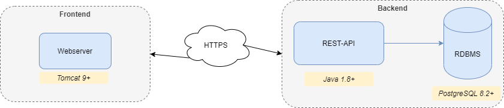

# Systemarchitektur CDA Demo Applikation

## Überblick Architektur

Die CDA Demo Anwendung besteht aus einer Serverkomponente und einem Webclient.

Zur Persistierung der Daten wird auf eine relationale Datenbank zugegriffen.

### Server

Das Backend der Anwendung besteht aus einer REST-API sowie Datenbank.

Die REST-API ist in `Java` mit Hilfe von `Spring Boot` realisiert.

Zum Ausführen der Backend-Komponente ist eine `Java Runtime`  nötig. Die Komponente wird als ausführbares JAR-File ausgeliefert und kann direkt oder als Service gestartet werden.

**Voraussetzungen:**

- JRE mindestens in Version 1.8
  - Bevorzugt [OpenJDK][1] oder [AdoptOpenJDK][2]

### Datenbank

Als Datenbank wird die freie Datenbank PostgreSQL verwendet.

**Voraussetzungen:**

- [PostgreSQL Verion 8.2 oder höher][3]

### Client

Der Client wird als statische JavaScript Website geliefert.
Die Implementierung erfolgt mittels dem React Framework Next.js.

Das erzeugte WAR File ist in jedem Servletkontainer installierbar - empfohlen wird ein Tomcat.

**Voraussetzungen:**

- [Apache Tomcat Version 9 oder höher][4]

[1]: https://openjdk.java.net/
[2]: https://adoptopenjdk.net/
[3]: https://www.postgresql.org/download/
[4]: https://tomcat.apache.org/download-90.cgi